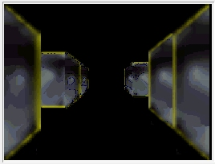
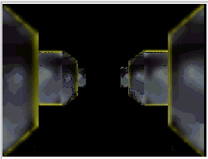
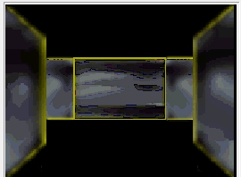
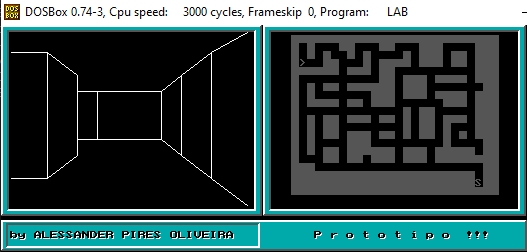
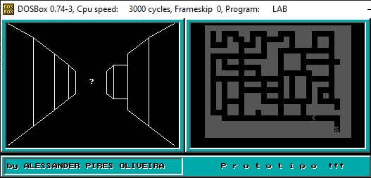
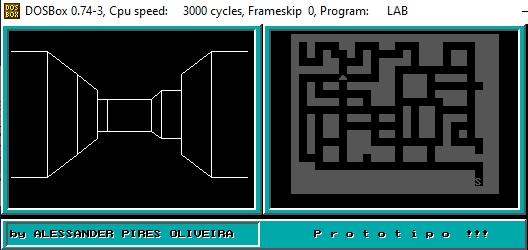

# LABIRINT

It's an algorithm for a 3D Labirint (simulated) that I invented when I was a kid in 1988. It's just a technic that I created at that time to play and have fun learning MSX Basic and starting C programming at those time.

<table width:100%>
  <tr><td colspan=3><b>Windows (pascal version)</b></td></tr>
  <tr>
    <td></td>
    <td></td>
    <td></td>
  </tr>
  <tr><td colspan=3><b>DOS (C version)</b></td></tr>
  <tr>
    <td></td>
    <td></td>
    <td></td>
  </tr>
  <tr><td colspan=3>From the C and C++ files ".exe" should be run well on a DOSBox (in fact that was the way I got these screenshots above).</td></tr>
</table>
